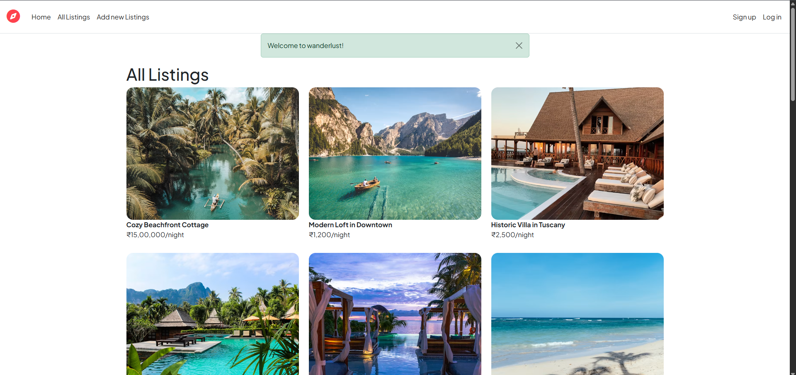
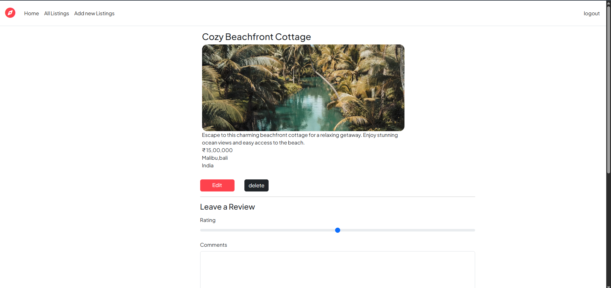
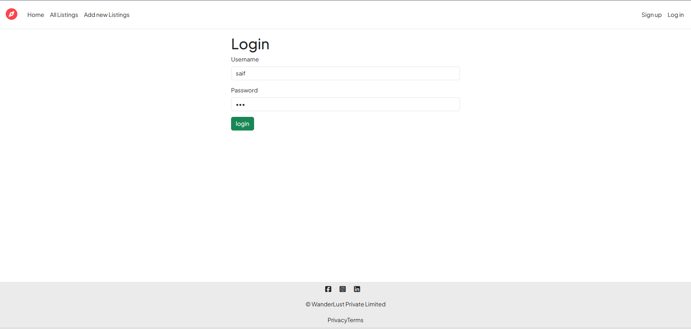
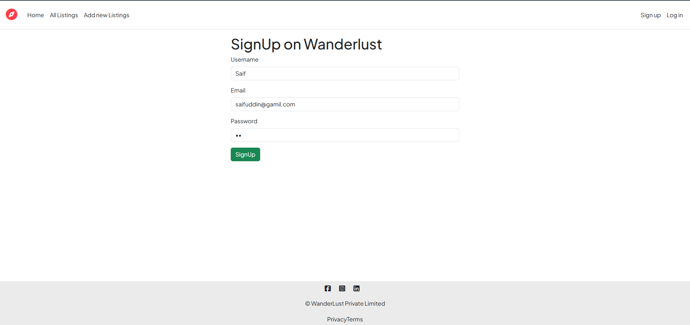

# 🏕️ WanderLust

WanderLust is a full-stack travel and accommodation listing web application built with **Node.js, Express.js, MongoDB, and EJS**. The application allows users to create accounts, create and manage travel listings, upload listing images, and leave reviews on listings.

The project was developed as a major full-stack web development project to practice backend development, database integration, authentication, server-side rendering, routing, middleware, and CRUD operations.

---

## ✨ Features

### 👤 User Authentication
- User signup and login
- User logout
- Session-based authentication using Passport.js
- Password authentication using Passport Local Mongoose

### 🏡 Listings
- View all available listings
- View individual listing details
- Create new listings
- Edit existing listings
- Delete listings
- Upload images for listings

### ⭐ Reviews
- Add reviews to listings
- View reviews associated with listings
- Delete reviews

### 🔔 User Feedback
- Success and error flash messages
- Custom error pages
- 404 handling for invalid routes

### 🛠️ Backend
- RESTful routing
- MongoDB database integration
- Mongoose models and schemas
- Express middleware
- Form data handling
- HTTP method overriding for PUT and DELETE requests

---

## 🧰 Tech Stack

### Frontend
- HTML
- CSS
- JavaScript
- EJS
- EJS-Mate

### Backend
- Node.js
- Express.js

### Database
- MongoDB
- Mongoose

### Authentication & Sessions
- Passport.js
- Passport Local
- Passport Local Mongoose
- Express Session

### Other Technologies
- Joi
- Connect Flash
- Method Override
- Cookie Parser

---

## 📂 Project Structure

```text
WanderLust/
│
├── app.js
├── middleware.js
├── schema.js
├── package.json
├── package-lock.json
├── README.md
├── LICENSE
│
├── screenshots/
│   ├── home.png
│   ├── listings.png
│   ├── listing-details.png
│   ├── login.png
│   └── signup.png
│
├── init/
│   ├── data.js
│   └── index.js
│
├── models/
│   ├── listing.js
│   ├── review.js
│   └── user.js
│
├── public/
│   ├── css/
│   │   └── style.css
│   └── js/
│       └── script.js
│
├── routes/
│   ├── listing.js
│   ├── review.js
│   └── user.js
│
├── utils/
│   ├── ExpressError.js
│   └── wrapAsync.js
│
└── views/
    ├── error.ejs
    ├── includes/
    │   ├── flash.ejs
    │   ├── footer.ejs
    │   └── navbar.ejs
    │
    ├── layouts/
    │   └── boilerplate.ejs
    │
    ├── listings/
    │   ├── edit.ejs
    │   ├── index.ejs
    │   ├── new.ejs
    │   ├── root.ejs
    │   └── show.ejs
    │
    └── users/
        ├── login.ejs
        └── signup.ejs
```

---

## ⚙️ Getting Started

Follow these steps to run WanderLust locally.

### 1. Clone the repository

```bash
git clone https://github.com/DataWhiz314/WanderLust.git
```

### 2. Navigate to the project directory

```bash
cd WanderLust
```

### 3. Install dependencies

```bash
npm install
```

### 4. Start MongoDB

Make sure MongoDB is installed and running locally.

The application currently uses:

```text
mongodb://127.0.0.1:27017/wanderlust
```

The database will be named:

```text
wanderlust
```

### 5. Start the application

```bash
node app.js
```

The server will start on:

```text
http://localhost:8080
```

Open the URL in your browser to access the application.

---

## 🗄️ Database Models

WanderLust uses Mongoose to manage its MongoDB database.

### User

Handles user authentication and account information.

### Listing

Stores information about travel/accommodation listings, including listing details and images.

### Review

Stores reviews associated with listings.

---

## 🔐 Authentication

Authentication is implemented using:

- Passport.js
- Passport Local Strategy
- Passport Local Mongoose
- Express Session

User sessions are maintained using `express-session`, allowing users to remain authenticated while navigating through the application.

---

## 🚨 Error Handling

WanderLust includes custom error handling using:

```text
utils/ExpressError.js
```

The application handles invalid routes and server errors through Express middleware and displays an EJS-based error page.

Asynchronous operations are handled using:

```text
utils/wrapAsync.js
```

---

## 🖼️ Screenshots

### 🏠 Home Page



### 🏡 Listings


### 📍 Listing Details



### 🔐 Login



### 📝 Signup



---

## 🚧 Current Limitations

The current version of WanderLust does not yet include:

- ❌ Ratings
- ❌ Listing ownership authorization
- ❌ Search and filtering
- ❌ Maps/location integration
- ❌ Responsive/mobile-specific design
- ❌ Production deployment

---

## 🔮 Future Improvements

Possible improvements include:

- [ ] Add authorization so users can only edit/delete their own listings
- [ ] Add star ratings
- [ ] Implement search and filtering
- [ ] Integrate maps and location services
- [ ] Improve responsive design for mobile devices
- [ ] Add cloud-based image storage
- [ ] Deploy the application
- [ ] Add more advanced validation
- [ ] Improve UI/UX
- [ ] Add automated tests

---

## 📌 Project Status

**Status:** 🚧 Local Development

WanderLust is currently running locally and is not deployed to a production environment.

---

## 👨‍💻 Author

**Saif**

GitHub: [DataWhiz314](https://github.com/DataWhiz314)

---

## 📄 License

This project is licensed under the **ISC License**.
